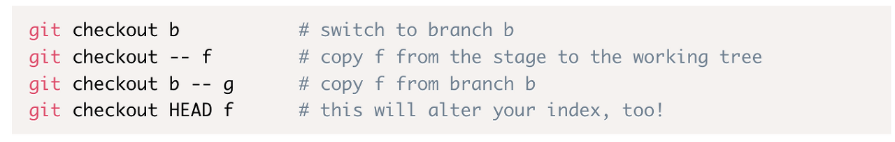

git checkout은 크게 두 가지 용도로 사용되었다.

- 브랜치 관리(브랜치 간 이동, 브랜치 생성, 복사 등)
- 워킹 트리 파일 복원 (더 정확히 말하자면 스테이징 된 파일을 워크스페이스에 복사하는 작업. 일종의 복원이다.)

그러나 git checkout의 두 가지 기능은 “새로운 git 사용자들에게 혼란을 주고, git 사용자 경험에 해롭다”는 의견이 대세였다.

> 브랜치를 운용하는것과, 특정 브랜치의 워킹 트리의 파일을 수정하는 것은 논리적으로 별개의 작업이다.
>
> 브랜치를 운용하는 것은 독립된 작업을 위한 환경을 마련하고 관리하는 것이고, 워크스페이스의 변경사항을 수정하거나 복원하는 것은 특정 브랜치 내 특정 작업에 관한 것이기 때문이다.

또한 checkout은 스테이징된 파일을 워크스페이스에 복사하는 것 뿐만 아니라, index를 바꾸기도 한다.

따라서 서로 다른 두 작업에 대해 하나의 명령어를 사용하는 것은 좋지 않다.

그래서 git 2.23부터는 git checkout의 두 가지 기능을 각각 분리한 git switch와 git restore가 등장했다.

- 브랜치 간 이동: git switch
- 워킹 트리 파일 복원: git restore

참고: [https://www.infoq.com/news/2019/08/git-2-23-switch-restore/](https://www.infoq.com/news/2019/08/git-2-23-switch-restore/)
