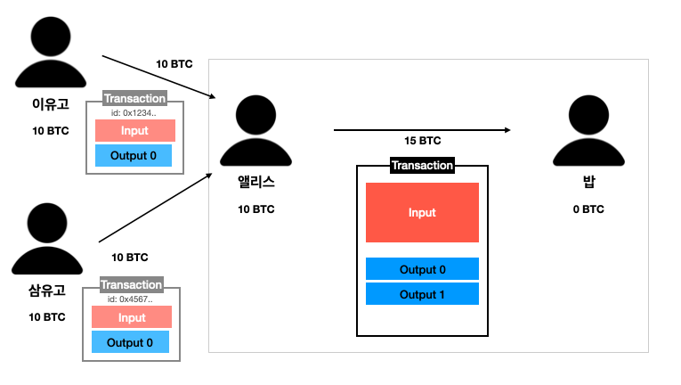

## UTXO(Unspent Transaction Output)

UTXO는 Unspent Transaction Output의 약자로, 비트코인의 소유권을 확인하는 방법입니다.

UTXO를 직역하면 **아직 소비하지 않은 트랜잭션 출력값**입니다.

이 글을 읽는 분이라면 아마 블록체인에 대해 어느정도 찾아봤을 것입니다. 그래서 트랜잭션은 거래 내역, 즉 코인의 소유권 변경을 기록한 것이고, 블록에 담겨 네트워크 노드에 전파된다는 것은 알고 있을 것입니다.

그렇다면 **트랜잭션의 아웃풋**이라는건 무엇일까요?
그리고 이 아웃풋이 **아직 소비되지 않았다**는 것은 무슨 의미일까요?

## 비트코인에서 송금을 할 때

### 앨리스가 밥에게 송금을 할 때는 트랜잭션을 기록해야 한다

앨리스와 밥의 예시를 들어서 설명해보겠습니다.

아래 그림과 같이, 앨리스는 10 BTC를 가지고 있으며, 밥에게 6BTC를 보내려고 합니다.

송금이라는 것은 곧 앨리스의 소유에 있는 일정량의 비트코인을 다른 계정의 소유로 바꾼다는 것입니다. 비트코인에서는(사실 비트코인 뿐만 아니라 대부분의 블록체인에서는) 이렇게 무언가 변화가 일어날 때 "트랜잭션"이라는 영수증을 작성해 변경사항을 기록합니다.

즉, 이 트랜잭션 안에 우리가 일으키고 싶은 변화를 적는 것이죠.

여기서는 앨리스가 가지고 있는 10 BTC 중 6BTC의 소유권을 밥에게 이전하는 것이 변경사항이 될 것입니다.

그런데, 사실은 트랜잭션에 이렇게 마음대로 적으면 안됩니다.
비트코인 네트워크는 노드라는 컴퓨터들에 의해 동작합니다. 그래서 사람 말로 적으면 이해를 하지 못합니다.

그래서 비트코인 네트워크에 있는 노드들이 이해할 수 있도록, 비트코인에서는 정형화된 트랜잭션 구조를 요구합니다.

그림처럼, 비트코인의 트랜잭션은 input과 output의 집합으로 이루어져 있습니다.

(물론 input과 output 외에도 트랜잭션에는 다양한 내용이 들어가지만, 여기서는 패스합니다)

## 비트코인 트랜잭션의 구조

트랜잭션은 Input과 Output의 집합으로 구성된다고 했습니다.
그렇다면 Input과 Output에는 무슨 내용이 들어갈까요?

먼저 Input 부터 살펴보겠습니다.

### 1) Transaction Input

#### 1. transaction ID

Input은 **송금자가 사용하려고 하는 송금자 소유의 UTXO**입니다.
지금은 UTXO가 뭔지 정확히 이해하지 않아도 됩니다. 일단 송금자 소유의 비트코인 정도로만 이해하고 넘어갑시다.

앨리스가 가진 10 BTC는 어디선가 자연 발생한게 아닐 것입니다. 다른 사람에게서 받은 것일수도 있고, 비트코인 초창기부터 채굴을 해서 받은 채굴 보상일 수도 있습니다.

여기서는 **앨리스가 이유고라는 사람에게서 10 BTC를 송금 받았다**고 가정합시다.
이유고가 앨리스에게 10 BTC를 보냈다면, 그 **송금 역시 트랜잭션으로 남아있을 것입니다.** 그 트랜잭션의 ID를 적는 곳이 바로 **transaction ID**입니다.

즉, Input의 transaction ID(txid)는 앨리스가 사용하려고 하는 자금의 출처를 적는 곳입니다.

#### 2. scriptSig (Unlocking Script)

scriptSig는 Script Signature의 약자입니다.

이유고가 앨리스에게 10 BTC을 보냈습니다. 이제 이 10BTC는 앨리스의 소유입니다.

따라서, 앨리스 외에 다른 사람은 이 10 BTC를 사용하지 못하도록 막아야 할 것입니다.

비트코인에서는 코인을 소유권자 외에 다른 사람이 사용하지 못하도록 하기 위해 **잠궈둡니다.**

어떻게 코인을 잠글 수가 있을까요?

**송금할 10 BTC를 앨리스의 공개키로 서명하여 코인을 잠글 수 있습니다.**
(이 표현 자체는 부정확합니다. 아래 좀 더 자세하게 서술합니다.)

> 공부 좀 하신 분들은 아시겠지만, 비트코인은 ECDSA 방식을 사용하고, 이 ECDSA는 한 쌍의 공개키와 비밀키를 만듭니다.
>
> 공개키로 암호화하면 비밀키로만 복호화할 수 있으며, 반대로 비밀키로 암호화하면 공개키로만 복호화할 수 있습니다.

앨리스의 공개키로 암호화한 이 10 BTC는 앨리스만 복호화해서 사용할 수 있습니다.
앨리스의 비밀키로만 이 10 BTC를 해제할 수 있습니다.
앨리스의 비밀키는 앨리스만이 가지고 있기 때문이죠.

따라서 앨리스의 공개키로 암호화된 이 10 BTC는 앨리스의 소유인 것입니다.

-

앨리스는 이제 이유고에게서 받은 10 BTC를 사용해 밥에게 송금을 하려고 합니다.

사용할 때는 잠궈져 있는 이 10 BTC를 자신의 개인키로 복호화하면 됩니다.
10 BTC를 개인키로 복호화하는 스크립트가 바로 scriptSig입니다. 잠궈져 있는 10 BTC를 해제하는 것이기 때문에 Unlocking Script(해제 스크립트)라고도 합니다.

결론적으로, **input에는 앨리스가 얼마를 사용할 것인지가 적혀있습니다.**

### 2) Transaction Output

#### 1. amount

수신자에게 보낼 비트코인의 양입니다.
밥에게는 6 BTC를 보낼 테니 여기서 amount는 6이 될 것입니다.

#### 2. ScriptPubKey

앞에서 비트코인을 송금할 때는 이 비트코인을 받을 사용자만 사용할 수 있도록 비트코인을 '잠근다'고 했습니다.

밥에게 6 BTC를 보낸다는 것은, 이 6BTC를 **밥만 사용할 수 있도록** 만들어야 한다는 것을 의미합니다.

ScriptPubKey는 6 BTC를 밥의 공개키로 잠궈버리는 스크립트입니다. 밥의 공개키로 잠궈버리면 밥의 비밀키로만 복호화 해 잠금을 풀 수 있습니다.

> **💡 비트코인을 잠근다?**
>
> 앞에서 "10 BTC를 앨리스만 사용할 수 있게 잠근다", "6 BTC를 밥만 사용할 수 있도록 잠근다"라고 했습니다.
>
> "비트코인을 잠근다"라는 것은 scriptSig를 사용해 amount 만큼이 담긴 **Output을 잠근다**는 것을 의미합니다.
>
> 따라서 **Input의 transaction ID는 자신의 공개키로 잠궈진 Output을 가리키는 것입니다.**

## 다시 앨리스와 밥의 예시로

### 트랜잭션 Input, Output에 실제로 무엇을 넣을까

아직 이해가 잘 안됐을 것입니다.

다시 앨리스와 밥의 예시로 돌아가봅시다.

앨리스는 트랜잭션을 작성합니다.

Input의 transaction ID에는 앨리스가 이유고에게서 10 BTC를 받을 때 들어간 트랜잭션의 ID를 넣습니다.

아래 그림에서, 이유고가 앨리스에게 10 BTC를 보낼 때 사용된 트랜잭션의 ID는 0x1234 라고 합니다. 이 값을 Input의 transaction ID에 넣습니다.

그리고 이유고가 만든 트랜잭션 안에 들어있는 Output을 사용하기 위해 앨리스의 비밀키로 잠금을 해제하는 스크립트(scriptSig)를 추가합니다.

여기가 중요합니다. Output은 어떻게 작성할까요?

먼저 밥에게 6 BTC를 보내야 하니 Output의 amount에 6을 넣습니다.

그리고 이 Output을 오직 밥만 사용할 수 있도록 Locking Script(ScriptPubKey)에 밥의 공개키로 서명한 스크립트를 넣습니다.
이제 이 6 BTC가 담긴 Output은 밥만이 사용할 수 있습니다.

이렇게 하면 트랜잭션이 완성일까요?

### 남은 4 BTC는 어디로?

아닙니다. 트랜잭션을 잘 읽어보세요.

Input에는 앨리스 소유의 10 BTC를 쓴다고 했고,
Output에는 이 10 BTC 중 6 BTC를 밥에게 보낸다고 적혀있습니다.

그렇다면 남은 4 BTC는 어디로 가는 걸까요?

우리가 일반적으로 은행에서 송금을 할 때는 100만원 중 10만원을 보내면 나머지 90만원은 그대로 계좌에 남아있지만, 비트코인은 다릅니다.

만약 이 상태로 트랜잭션을 제출하면 남은 4 BTC는 사라지게 됩니다.

### 비트코인에서 송금은 "박스에 돈을 나눠담는 일"

모든 비트코인은 어떤 박스 안에 담겨있으며, 이 박스는 소유자의 공개키로 암호화 되어 있습니다.
송금을 한다는 것은, **_소유자가 자신의 박스를 자신의 개인키로 해제한 후, 다른 박스에 나눠담는 것_**입니다.

> **Input**은 10 BTC가 담긴 박스를 **해제**하는 것입니다.
>
> transaction ID로 어떤 박스인지 지정하고 scriptSig에 박스를 해제하는 스크립트를 담습니다.
>
> **Output**은 박스에 들어있던 10 BTC 중 원하는 양을 다른 박스에 담아 **받는 사람의 공개키로 잠그는 것**입니다.

앨리스와 밥의 예시를 박스로 표현하면 아래의 그림과 같습니다.

앨리스는 10 BTC가 들어있는 박스를 풀고, 새로운 박스를 하나 만듭니다.
이 새로운 박스에는 6 BTC를 넣고 밥의 공개키로 잠급니다.

비트코인은 한번 해제한 박스는 다시 재사용할 수 없습니다.

남은 4 BTC를 계속 앨리스의 소유로 두려면 어떻게 해야 할까요?
박스를 하나 더 만들어서, 남은 4 BTC를 담고 다시 자기 자신에게 보내야 합니다.

### 남은 4 BTC를 자기자신이 사용할 수 있도록 Output 추가

다시 앨리스와 밥의 예시로 돌아옵시다.

앨리스가 밥에게 10 BTC 중 6 BTC를 보내는 트랜잭션에서, 남은 4 BTC를 계속 소유하기 위해서는 4BTC를 자기자신의 공개키로 암호화한 Output을 추가해야 합니다.

이제 트랜잭션이 완성되었습니다.

이 트랜잭션이 정상적으로 블록체인에 올라가게 되면,
앞으로 밥은 Output 0을 사용할 수 있습니다.
앨리스는 Output 1을 사용할 수 있습니다.

## 정리

아직 Input 값이 헷갈릴 수 있습니다.
어떻게 앨리스는 이유고에게서 받은 10 BTC를 사용할 수 있었던 걸까요?

바로 이유고가 만든 트랜잭션의 Output 0에는 이렇게 쓰여있었기 때문입니다.

- amount: 10
- locking script: 앨리스의 공개키로 암호화된 스크립트

즉, 앨리스는 이유고가 만든 트랜잭션에 있는 Output 0을 사용한 것입니다.

**이유고가 앨리스에게 10 BTC를 보낸 시점에서 이 Output 0은 아직 해제되어 사용되지 않은 상태입니다.**
즉, Output 0은 어떤 트랜잭션의 Input 값으로도 사용되지 않았습니다.

이렇게 트랜잭션의 Output이 다른 트랜잭션의 Input으로 아직 사용되지 않은 상태를
**UTXO(Unspent Tx Output, 아직 소비되지 않은 트랜잭션 아웃풋)** 이라고 합니다.

이후 이유고가 만든 트랜잭션의 Output 0은 앨리스에 의해 새로운 트랜잭션의 Input에 넣어졌기 때문에 더이상 UTXO가 아니게 됩니다.(한번 사용된 Output은 다시 사용할 수 없습니다)

대신, 새로운 트랜잭션으로 인해 새로운 UTXO 두 개가 생기게 되었습니다.

정리하면, **UTXO는 어떤 트랜잭션으로 인해 생긴 아직 사용되지 않은 Output**이며,
송금 트랜잭션으로 인해 Input 값으로 사용되면 UTXO로의 기능은 잃게 됩니다.

## 여러 개의 Input을 사용하는 경우

한 가지 예시를 더 들어보겠습니다.

만약, 앨리스가 이유고에게 10 BTC를 받았고, 삼유고에게도 10 BTC를 받았다고 가정해봅시다.

앨리스가 가진 자산은 총 20 BTC가 되며, 이 중 밥에게 15 BTC를 전송하고 싶습니다.

이 때 트랜잭션을 어떻게 작성해야 할까요?

답은 간단합니다.

이유고가 만든 트랜잭션에 있는 UTXO와, 삼유고의 트랜잭션에 있는 UTXO를 Input으로 넣어주면 됩니다.

이렇게 Inputd에는 총 20 BTC가 있게 됩니다.

Output에는 밥의 공개키로 암호화한 스크립트를 넣고, 나머지 5 BTC가 들어있는 Output은 앨리스의 공개키로 암호화한 스크립트를 넣으면 됩니다.
